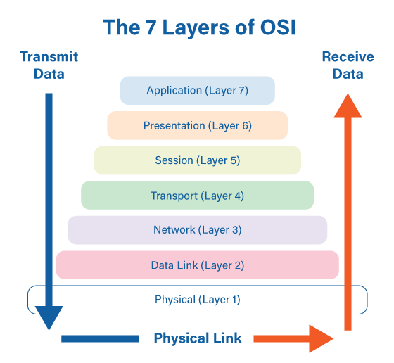

# OSI 7 계층

국제 표준화 기구(ISO)에서 네트워크 통신이 일어나는 과정을 7단계로 나눈 네트워크 표준 모델이다.

각 레이어의 프로토콜은 하위 레이어의 프로토콜이 제공하는 기능을 사용하여 동작한다.

## 제 1 계층 물리(Physical Layer)

- encoding, 0과 1의 나열을 아날로그 신호로 바꿔서 전선으로 흘려보낸다.  
  decoding, 아날로그 신호가 들어오면 0과 1의 나열로 바꿔 해석한다.  
  결과적으로 물리적 연결이 되어있는 두대의 컴퓨터가 0과 1의 나열을 주고받을 수 있게 해주는 모듈(module).
- PHY 칩에서 작동, 하드웨어적으로 구현.
- 전기적 신호가 나가는 **물리적인 장비**

> 전송단위: 비트(Bit)  
> 장비: 케이블, 허브

## 제 2 계층 데이터 링크(Data-Link Layer)

- 사전지식
  - 두대의 컴퓨터는 스위치를 통해 데이터를 원하는 **목적지**에 전달한다.
  - 여러 인트라넷 각각의 스위치를 서로 연결해서 서로 다른 네트워크 상의 컴퓨터끼리 통신할 수 있게 만드는 장비를 router라고 한다.
  - 컴퓨터는 데이터를 보낼때 시작과 끝에 특정한 비트열을 붙여서 전송한다.(Framing)
- 같은 네트워크에 있는 여러대의 컴퓨터들이 데이터를 주고받기 위해 필요한 모듈.
- Framing은 2계층에 속한 여러 작업들 중 하나.
- 랜카드에서 작동, 하드웨어적으로 구현.
- 프레임에 Mac 주소를 부여하고 에러검출, 재전송, 흐름제어를 진행한다.

> 전송단위: 프레임(Frame)  
> 장비: 브릿지 스위치

## 제 3 계층 네트워크(Network Layer)

- 수많은 네트워크들의 연결로 이루어지는 inter-network속에서 어딘가에 있는 목적지 컴퓨터로 데이터를 전송하기 위해 ip주소를 이용해 길을 찾고(routing) 자신 다음의 라우터에게 데이터를 넘겨주는(forwarding) 모듈.
- 운영체제의 커널에 소프트웨어적으로 구현.
- 경로(Route)와 주소(IP)를 정하고 패킷을 전달해준다

> 전송단위: 패킷(Packet/Datagram)  
> IP, 라우터

## 제 4 계층 전송(Transport Layer)

- Port 번호를 사용하여 도착지 컴퓨터의 최종 도착지인 프로세스에 까지 데이터가 도달하게 하는 모듈, TCP와 UDP 프로토콜을 통해 통신을 활성화한다.
- 운영체제의 커널에 소프트웨어적으로 구현.
- 데이터를 전송하기 위한 오류검출 및 복구, 흐름제어와 중복검사등을 수행한다.

> 전송단위: 세그먼트(Segment)  
> TCP/UDP

## 제 5 계층 세선(Session Layer)

- 애플리케이션 간의 통신에서 세션을 관리
- 데이터가 통신하기 위한 논리적 연결을 담당한다.
- TCP/IP 세션을 만들고 없애는 책임을 갖고 있다.

> API, Socket

## 제 6 계층 표현(Presentation Layer)

- 애플리케이션 간의 통신에서 메시지 포맷 관리
- 데이터의 변환,압축,암호화가 이루어지는 계층

> 인코딩 <-> 디코딩  
> 암호화 <-> 복호화  
> 압축 <-> 압축 풀기   
> JPEG, MPEG

## 제 7 계층 응용(Application Layer)

- 애플리케이션 목적에 맞는 통신 방법 제공

> HTTP, DNS, SMTP, FTP 프로토콜들이 속한 계층

## 참고 문헌

[1. Inpa Dev](https://inpa.tistory.com/entry/WEB-%F0%9F%8C%90-OSI-7%EA%B3%84%EC%B8%B5-%EC%A0%95%EB%A6%AC)
